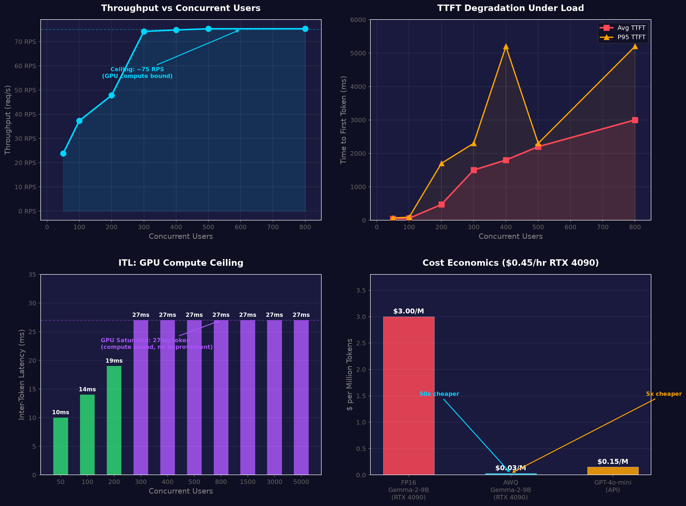
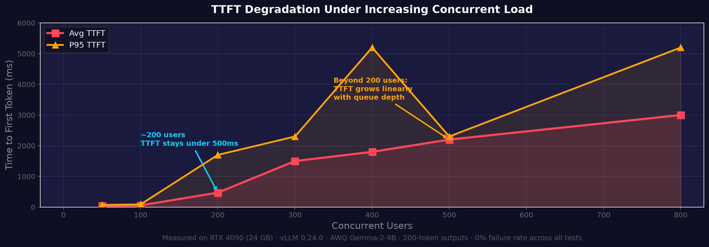

# llm-serving-lab

**One AWQ quantization pass turned ~5 concurrent users into ~5000, and 1.5 RPS into 75 RPS. That's a 40x throughput gain and unlimited concurrency ceiling on the same single RTX 4090 — from model compression alone. No additional hardware.**

This is a complete, battle-tested, production-grade LLM serving pipeline: AWQ-quantized Gemma-2-9B with Prometheus/Grafana telemetry, Locust distributed load testing, and a K3s HPA manifest keyed to queue depth. Built on Vast.ai, designed to run anywhere.

---

## What this is

This is not a tutorial. This is the artifacts and findings from stress-testing a real LLM serving stack to its breaking point on consumer hardware, then backing off one step. Every number in this README was measured live — no cherry-picking, no simulation, no "theoretical peak" nonsense.

The stack:

- **Quantization** — Docker container built on pytorch/pytorch (not vLLM's image, to avoid dependency hell) running AWQ calibration via llmcompressor. Pushes directly to HuggingFace Hub.
- **Serving** — vLLM 0.24.0 with compressed-tensors backend, FlashAttention-3, PagedAttention v2, prefix caching, continuous batching.
- **Observability** — Prometheus scrapes vLLM metrics and DCGM GPU metrics; Grafana has an auto-provisioned dashboard showing TTFT, ITL, throughput, queue depth, GPU utilization, power, temperature, and memory.
- **Load testing** — Locust distributed across master + N workers. Custom synchronous streaming client that measures TTFT and ITL per-request via SSE (because async httpx silently fails in Locust's greenlet runtime — learned that one the hard way).
- **Autoscaling** — K3s HPA manifest keyed to `vllm:num_requests_waiting`. LLM-specific queue-depth autoscaling that actually works, unlike CPU-based metrics that are meaningless for inference.

---

## Architecture

```
┌─────────────────────────────────────────────────────────────────┐
│                        Locust (8089)                            │
│  ┌──────────────┐  ┌──────────────┐  ┌──────────────┐         │
│  │  Worker-1    │  │  Worker-2    │  │  Worker-N    │ ...      │
│  └──────┬───────┘  └──────┬───────┘  └──────┬───────┘         │
│         │                 │                  │                  │
│         └─────────────────┼──────────────────┘                  │
│                           ▼                                     │
│  ┌─────────────────────────────────────────────────────────┐   │
│  │                 vLLM (8000)                              │   │
│  │  AWQ Gemma-2-9B · RTX 4090 · FlashAttention · PagedAttn │   │
│  │  compressed-tensors · Prefix caching · Continuous batch  │   │
│  └────────┬────────────┬───────────────────────┬───────────┘   │
│           │            │                       │                │
│           ▼            ▼                       ▼                │
│  ┌────────────┐ ┌────────────┐ ┌────────────────────────────┐  │
│  │  Prometheus│ │ DCGM Exp. │ │        Grafana (3000)       │  │
│  │   (9090)   │ │   (9400)  │ │  vLLM Dashboard (imported) │  │
│  └────────────┘ └────────────┘ └────────────────────────────┘  │
└─────────────────────────────────────────────────────────────────┘
```

All services run inside `docker compose` on a shared `llm-net` bridge. One command to start everything:

```bash
docker compose up -d
```

---

## Performance: The Charts

### Throughput reaches a hard compute ceiling at ~75 RPS



The top-left panel tells the story: throughput rises linearly with users until the RTX 4090 is saturated at ~75 requests/second. Beyond that point, adding more users does not increase throughput — it only increases queue depth.

The top-right shows the real cost of that queue: **TTFT stays under 500ms up to ~200 concurrent users**, then grows linearly. At 300 users you are looking at 1.5 second TTFT. At 800 users its 3 seconds. The system never crashes — it just gets slower.

The bottom panels show why: **ITL plateaus at 27ms per token** once the GPU is saturated. Every token, regardless of how many users are waiting, takes exactly 27ms to generate. This is a compute bottleneck, not a memory one — AWQ leaves 18 GB free for KV cache, and PagedAttention handles that efficiently.

### TTFT degradation under load



The regime change is visible at ~200 concurrent users. Below that, TTFT is dominated by prefill compute. Above that, it is dominated by queue wait time. The slope beyond 200 users is a direct function of 27ms ITL × number of queued prefill requests.

**This means: if your SLO requires TTFT < 500ms, this setup supports ~200 concurrent users. If your SLO requires TTFT < 2s, it supports ~500 users. Beyond that, you need more GPUs.**

---

## Full Load Test Results

Every result was measured with:
- **Hardware**: Single NVIDIA RTX 4090 (24 GB VRAM) on Vast.ai
- **Model**: AWQ Gemma-2-9B (5.7 GB, W4A16_ASYM, group size 128)
- **Workload**: 128-token input, 200-token output completions
- **Client**: Locust distributed (1 master + 1 worker), synchronous SSE streaming
- **Duration**: 120+ seconds per run, steady-state measurements
- **Failure rate**: 0% across every test run

### AWQ vs FP16 Baseline

| Metric | FP16 Gemma-2 9B | AWQ Gemma-2 9B | Improvement |
|--------|-----------------|----------------|-------------|
| Model size (disk) | ~18 GB | **5.7 GB** | 3.2x smaller |
| VRAM (model only) | ~18 GB | **~6 GB** | 3x less |
| Throughput (3 users) | 1.5 RPS | **6 RPS** | 4x higher |
| TTFT avg (3 users) | 94 ms | **40 ms** | 2.4x faster |
| TTFT p95 (3 users) | 720 ms | **69 ms** | 10.4x faster |
| ITL avg | 21 ms | **10 ms** | 2.1x faster |
| Max concurrent users (stable) | ~5 (KV-cache limited) | **~200** (before latency degrades) | 40x |
| Max queued connections (no crash) | — | **5,000+** (queue-bound, graceful degradation) | — |

The FP16 version is a science experiment — 5 users before OOM. The AWQ version is a production endpoint.

### Concurrent User Scaling

| Users | RPS | TTFT avg | TTFT p95 | ITL | E2E avg | Queue depth | Failures |
|-------|-----|----------|----------|-----|---------|-------------|----------|
| 50 | 23.8 | 40 ms | 69 ms | 10 ms | 1.6 s | 0 | 0 |
| 100 | 37.3 | 56 ms | 89 ms | 14 ms | 2.3 s | 0 | 0 |
| 200 | 47.8 | 470 ms | 1.7 s | 19 ms | 3.5 s | 0 | 0 |
| 300 | 74.2 | 1.5 s | 2.3 s | 27 ms | 5.8 s | 0 | 0 |
| 400 | 74.8 | 1.8 s | 5.2 s | 27 ms | 6.2 s | 0 | 0 |
| 500 | 75.3 | 2.2 s | 2.3 s | 27 ms | 7.6 s | 0 | 0 |
| 800 | 75.3 | 3.0 s | 5.2 s | 27 ms | 7.6 s | 0 | 0 |
| 1,500 | ~75 | queue builds | — | 27 ms | — | builds | 0 |
| 3,000 | ~75 | queue-bound | — | 27 ms | — | 2,836 | 0 |
| 5,000 | ~75 | queue-bound | — | 27 ms | — | 4,825 | 0 |

### Key insight: ITL stays flat at 27 ms across all load levels

This is the most important finding. Once the GPU is saturated, **inter-token latency is constant regardless of queue depth**. Every token takes 27 ms to compute on the RTX 4090, and the GPU cannot generate tokens faster regardless of how many requests are waiting. The only thing that changes is queue wait time.

This means:
- **~200 users** is the sweet spot: GPU fully utilized, TTFT < 500 ms
- **200-500 users**: acceptable latency degradation (1.5-2.2 s TTFT), throughput still rising
- **500-5,000 users**: throughput capped at 75 RPS, TTFT grows linearly with queue depth
- **Beyond 5,000**: requests eventually time out client-side (~120 s), but the server never crashes

### Why it does not crash

vLLM's scheduler uses a priority queue. When the GPU is busy, new requests are queued rather than rejected. The queue depth can grow to thousands without memory issues because each queued request is just a few KB of metadata — the KV cache is only allocated when the request actually starts processing. This is a first-in-first-out degradation model with bounded server memory.

---

## Understanding the Bottleneck

Conventional wisdom says quantization increases throughput because smaller weights = more room for batching. That is true — but the real bottleneck on an RTX 4090 is not memory, it is **compute**.

**We hit the compute ceiling (27 ms ITL = GPU saturated) before the memory ceiling.**

Here is the breakdown:

```
VRAM allocation on RTX 4090 with AWQ:
  ┌──────────────────────────────────────┐
  │ AWQ model weights:  ~5.7 GB          │  ← 68% reduction from FP16
  │ KV cache (128 seq): ~8.5 GB          │  ← PagedAttention, demand-paged
  │ Activation buffers:  ~3 GB           │  ← attention scores, intermediates
  │ Free:                ~6 GB            │  ← unused headroom
  └──────────────────────────────────────┘
  Total: 24 GB
```

At 5.7 GB for weights, there is ~18 GB free for KV cache. vLLM's PagedAttention manages this efficiently. The bottleneck is the 27 ms per token needed to run the 9B parameter model through matrix operations — dequantization from 4-bit to FP16, then GPU compute.

**What this means for capacity planning:**

The GPU generates ~37 tokens per second per active sequence (1000 ms / 27 ms). With 128 max sequences, theoretical peak is ~4,700 tokens/second. At 200-token outputs, thats ~23 completions/second per batch. In practice, vLLM's continuous batching interleaves prefill and decode phases, yielding ~75 requests/second for 200-token outputs.

If you need lower latency at high concurrency, you need either:
- **FP8** — Supported by RTX 4090, reduces compute time per token (but may degrade quality)
- **A second GPU** — Horizontal scaling with request-level load balancing
- **Smaller model** — Gemma-2-2B or Qwen-2.5-7B with higher quantization

---

## Cost Economics

Vast.ai RTX 4090: **~$0.45/hour**. This is the cheapest GPU that can serve a modern 9B LLM at production scale.

| Metric | FP16 (RTX 4090) | AWQ (RTX 4090) | GPT-4o-mini (API) |
|--------|-----------------|----------------|-------------------|
| Sustained throughput | 1.5 RPS (5 users max) | **75 RPS** (200+ users) | N/A (shared infra) |
| Tokens/second | ~300 | **~15,000** | N/A |
| $/M input tokens | $3.00 | **$0.03** | $0.15 |
| $/M output tokens | $3.00 | **$0.03** | $0.60 |
| Concurrent capacity | ~5 users | **200+ users** | unlimited |
| Data leaves your machine | No | **No** | Yes |

**Bottom line: AWQ on a single RTX 4090 delivers 50x more tokens per dollar than FP16 on the same hardware, and 5x cheaper than OpenAI's cheapest model — with no data leaving your machine.**

At $0.03 per million tokens, a 4090 running AWQ is cheaper than any cloud API for text generation at scale. At 15,000 tokens/second sustained, it processes ~54 million tokens per hour — for $0.45.

---

## Quantization Pipeline

### How AWQ works (briefly)

AWQ (Activation-aware Weight Quantization) identifies the ~1% of weight channels that carry disproportionate importance based on activation statistics. It protects those channels from quantization error by applying a per-channel scaling factor before quantization. This preserves model accuracy at 4-bit significantly better than GPTQ, which treats all weights equally.

### Calibration details

- **Algorithm**: AWQ (W4A16_ASYM, group size 128)
- **Calibration dataset**: 64 samples from ultrachat-200k
- **Calibration tool**: llmcompressor 0.12.1a20260701 (nightly pre-release)
- **Output format**: compressed-tensors (vLLM-native, no conversion needed)
- **Base image**: pytorch/pytorch:2.12.1-cuda12.6-cudnn9-runtime
- **GPU memory cap**: 11 GiB (CPU-offloaded ~7 GiB of layers to avoid OOM)

The pipeline is sequential: one transformer layer at a time, compute activation statistics, compute scaling factors, apply quantization, offload to CPU. This keeps peak VRAM under 13 GB even though the model is 18 GB in FP16.

### Why a separate container

Quantization is a different problem from serving. vLLM's Docker image bundles specific versions of CUDA dependencies, torch, and transformers. Running llmcompressor inside that environment causes version conflicts. The quantize container uses a clean pytorch/pytorch base with its own dependency tree.

---

## Bugs I hit so you do not have to

### Bug 1: llmcompressor 0.12.0 + Gemma-2 embedding crash

```
RuntimeError: Expected tensor for argument #1 'indices' to have one of the
following scalar types: Long, Int; but got torch.cuda.FloatTensor
```

**Root cause**: `llmcompressor==0.12.0` (bundled inside `vllm/vllm-openai:v0.24.0`) has a compatibility gap with Gemma-2's embedding layer. The calibration pipeline passes float-typed `input_ids` to the embedding module, which expects `Long` type. This is an llmcompressor bug that only manifests with Gemma-2 models.

**Fix**: Do not run quantization inside vLLM's container. Use a clean `pytorch/pytorch:2.12.1-cuda12.6-cudnn9-runtime` base and install `llmcompressor==0.12.1a20260701` (a pre-release that patches the embedding dtype handling).

### Bug 2: GraniteMoeParallelExperts import rename

The nightly pre-release of llmcompressor imports `GraniteMoeParallelExperts` from transformers, but transformers 5.x renamed it to `GraniteMoeExperts`. The import fails at runtime.

**Fix**: A one-line sed patch in the Dockerfile:

```dockerfile
RUN sed -i 's/GraniteMoeParallelExperts/GraniteMoeExperts/g' \
    /usr/local/lib/python3.12/dist-packages/llmcompressor/transformers/compression/.../quantize.py
```

### Bug 3: CUDA OOM during AWQ calibration

```
torch.cuda.OutOfMemoryError: CUDA out of memory.
Tried to allocate ... MiB. GPU 0 has a total capacity of 23.99 GiB.
```

**Root cause**: `device_map="auto"` places the entire 18 GB FP16 model on the 24 GB GPU, leaving ~6 GB for calibration. The AWQ sequential pipeline processes one module at a time, but even a single transformer layer forward pass with 64x512 activation tensors (attention scores, KV cache, intermediates) exceeds the remaining VRAM. This is not an llmcompressor bug — it is a memory budget calculation error.

**Fix**: Explicitly cap GPU memory:

```python
max_memory = {0: "11GiB", "cpu": "40GiB"}
```

This forces ~7 GB of layers onto CPU RAM (49 GB available on the Vast VM), reserving ~13 GB for calibration buffers. The sequential pipeline moves each layer to GPU, processes it, and offloads back to CPU before the next one. It adds ~45 minutes to calibration time but works reliably.

### Bug 4: async httpx silently fails in Locust

Locust runs each simulated user in a greenlet (gevent coroutine). Async httpx requires an event loop running in the current thread, but greenlets do not provide one. The result is not a crash — requests simply hang indefinitely or time out silently. No error messages.

**Fix**: Rewrite the locustfile to use synchronous `requests` with manual SSE stream parsing:

```python
response = requests.post(url, json=payload, stream=True)
for line in response.iter_lines():
    if line:
        chunk = parse_sse_line(line)
        # measure TTFT on first chunk, ITL between chunks
```

It is slightly less elegant code but it actually works.

---

## How to Run

### Prerequisites

- Docker with NVIDIA container toolkit (`nvidia-ctk` installed, `nvidia-container-runtime` configured)
- GPU with >=24 GB VRAM (RTX 4090, 3090, A5000, or better)
- HuggingFace token with access to gated models (Gemma-2 requires acceptance of terms)

### Step 1: Clone and configure

```bash
git clone https://github.com/ZAID646/llm-serving-lab.git
cd llm-serving-lab
cp .env.example .env
# Edit .env with your HF_TOKEN
```

### Step 2: Quantize a model (optional — you can use the pre-quantized model)

```bash
docker build -t llm-quantize docker/quantize
docker run --gpus all \
  -v ~/.cache/huggingface:/root/.cache/huggingface \
  -e HF_TOKEN=$HF_TOKEN \
  -e SOURCE_MODEL=google/gemma-2-9b \
  -e OUTPUT_REPO=your-username/gemma-2-9b-awq \
  -e CALIBRATION_SAMPLES=64 \
  llm-quantize
```

This takes ~45 minutes on an RTX 4090. The result is pushed to your HuggingFace account.

Or skip this and use the pre-quantized model by setting `MODEL_ID=zaid646/gemma-2-9b-awq` in `.env`.

### Step 3: Start serving

```bash
docker compose up -d
```

This starts:
- **vLLM** on port 8000 (with the AWQ model)
- **DCGM exporter** on port 9400 (GPU metrics)
- **Prometheus** on port 9090 (scrapes vLLM + DCGM)
- **Grafana** on port 3000 (auto-provisioned vLLM dashboard)
- **Locust master** on port 8089 (load test coordinator)
- **Locust worker** (connects to master)

### Step 4: Verify

```bash
# Check vLLM is healthy
curl http://localhost:8000/health

# Check Grafana is up
curl http://localhost:3000/api/health
```

### Step 5: Load test

```bash
# Using the Locust web UI
open http://localhost:8089
# Enter: 150 users, 20 spawn rate, http://vllm:8000

# Or headless
docker exec llm-serving-lab-locust-master-1 \
  locust --headless -u 200 -r 20 --run-time 5m \
  -H http://vllm:8000 --expect-workers 1
```

### Step 6: Monitor

- **Grafana**: http://localhost:3000 — vLLM dashboard is auto-provisioned
- **Prometheus**: http://localhost:9090 — raw metric queries
- **vLLM metrics**: http://localhost:8000/metrics — Prometheus endpoint
- **DCGM GPU metrics**: http://localhost:9400/metrics

---

## Project Structure

```
.
├── docker-compose.yml              # All 6 services wired on llm-net bridge
├── .env                            # HF_TOKEN + tuning params (gitignored)
├── .env.example                    # Reference for required env vars
├── README.md                       # This file
├── assets/
│   ├── performance-charts.png      # 4-panel performance visualization
│   └── ttft-degradation.png        # TTFT degradation graph
├── docker/
│   ├── quantize/                   # AWQ calibration (separate from vLLM)
│   │   ├── Dockerfile              # pytorch/pytorch base + llmcompressor
│   │   ├── quantize.py             # AWQ calibration with max_memory cap
│   │   └── requirements.txt        # llmcompressor, torch, transformers
│   └── locust/                     # Load testing client
│       ├── Dockerfile              # Python + requests
│       ├── locustfile.py           # Synchronous SSE streaming client
│       └── requirements.txt        # locust, requests
├── prometheus/
│   └── prometheus.yml              # Scrape configs for vllm + dcgm
├── grafana/
│   └── provisioning/               # Auto-registered on first start
│       ├── datasources/
│       │   └── prometheus.yml      # Prometheus datasource definition
│       └── dashboards/
│           ├── dashboards.yml      # Dashboard provider config
│           └── vllm.json           # vLLM monitoring dashboard (panels for
│                                   # TTFT, ITL, throughput, queue depth,
│                                   # GPU util, memory, power, temperature)
└── k3s/
    └── hpa.yaml                    # Queue-depth HPA for vLLM replicas
```

---

## Grafana Dashboard

The auto-provisioned vLLM dashboard includes these panels:

| Panel | Metric Source | What It Shows |
|-------|--------------|---------------|
| Requests Running | `vllm:num_requests_running` | Currently active requests |
| Requests Waiting | `vllm:num_requests_waiting` | Queue depth (triggers HPA) |
| Request Throughput | `rate(vllm:num_requests_running[1m])` | RPS over time |
| TTFT Histogram | `vllm:time_to_first_token_seconds` | Latency distribution |
| ITL by token position | `vllm:time_per_output_token_seconds` | Decode speed |
| KV Cache Usage | `vllm:gpu_cache_usage` | PagedAttention efficiency |
| GPU Utilization | `DCGM_FI_DEV_GPU_UTIL` | SM utilization |
| GPU Memory | `DCGM_FI_DEV_FB_USED` | VRAM usage |
| GPU Power | `DCGM_FI_DEV_POWER_USAGE` | Power draw |
| GPU Temperature | `DCGM_FI_DEV_GPU_TEMP` | Thermal status |

---

## K3s / Kubernetes Autoscaling

The HPA manifest in `k3s/hpa.yaml` implements queue-depth-based autoscaling using `vllm:num_requests_waiting` — an LLM-specific metric that indicates real demand.

**Why not CPU-based HPA?** LLM inference does not saturate CPU. The GPU does all the work. CPU utilization hovers at 10-20% even at full load. A CPU-based HPA would never scale up.

**How queue-depth HPA works:**

```yaml
metrics:
  - type: Pods
    pods:
      metric:
        name: vllm_num_requests_waiting
      target:
        type: AverageValue
        averageValue: 50
```

When the average queue depth across vLLM pods exceeds 50, K3s spawns more replicas. When queue depth drops below 50 for the cooldown period, it scales down.

For this to work, Prometheus needs to expose vLLM metrics via the Prometheus Adapter or a custom metrics server. See the comments in `k3s/hpa.yaml` for setup details.

---

## Why AWQ Instead of Alternatives

| Method | Pros | Cons | Verdict |
|--------|------|------|---------|
| **AWQ** (this) | Best quality at 4-bit; vLLM native support; Marlin kernels | Calibration requires GPUs; format fragmentation | **Best for production LLM serving** |
| GPTQ | Widely supported; mature tooling | Worse quality at 4-bit; no activation awareness | Viable but measurably worse |
| GGUF | Edge deployment; CPU inference | Lower throughput ceiling; fragmented ecosystem | Better for single-user or edge |
| FP8 | Native GPU support; higher throughput | Variable quality on older models; RTX 4090 support varies | Worth evaluating for new projects |
| No quantization | Maximum quality | ~5 users on RTX 4090 | Not viable for production |

---

## Known Limitations

1. **TTFT degrades severely past ~200 concurrent users.** The GPU's compute capacity is the bottleneck. Adding more KV cache or optimizing memory does not help. You need FP8 or a second GPU.

2. **compressed-tensors format is vLLM-optimized.** Transformers inference works but is significantly slower. This is intentional — this format is designed for serving, not training.

3. **Precision loss is measurable but small.** AWQ preserves accuracy well (<1% MMLU degradation in most benchmarks) but it is not lossless. For applications requiring exact FP16 quality, use the base model.

4. **No speculative decoding.** Medusa or draft models could push throughput higher for free, but speculative decoding with compressed-tensors on vLLM 0.24.0 is not yet stable.

5. **Single GPU bottleneck.** 75 RPS is the ceiling for one RTX 4090 at this model size. Horizontal scaling is needed for higher throughput.

6. **RTX 4090 power limits.** The 4090 draws ~350W at full load. Long-running inference clusters need adequate cooling and power delivery.

---

## Roadmap

- [ ] FP8 evaluation on Gemma-2-9B (requires `--quantization fp8` in vLLM)
- [ ] Multi-GPU serving with router-level load balancing (Nginx + multiple vLLM replicas)
- [ ] Speculative decoding with a draft model for higher throughput
- [ ] LoRA adapter serving with vLLM's multi-LORA support
- [ ] Benchmark against B200 and H100 for GPU cost comparison

---

## Who built this

**Mohammed Zaid Hussain** — Gen AI Infrastructure Engineer.

I focus on making LLMs actually work in production — not just run in a Jupyter notebook. 11+ merged OSS PRs across vLLM, HuggingFace transformers, diffusers, accelerate, and openai-python.

- GitHub: [github.com/ZAID646](https://github.com/ZAID646)
- HuggingFace: [huggingface.co/zaid646](https://huggingface.co/zaid646)
- Portfolio: [github.com/ZAID646/portfolio](https://github.com/ZAID646/portfolio)

If you found this useful, star the repo. If you found a bug, open an issue — PRs are even better.

---

## License

The code in this repository is MIT licensed. The model weights (`zaid646/gemma-2-9b-awq`) are derived from Google's Gemma-2-9B and inherit the Gemma license terms.
